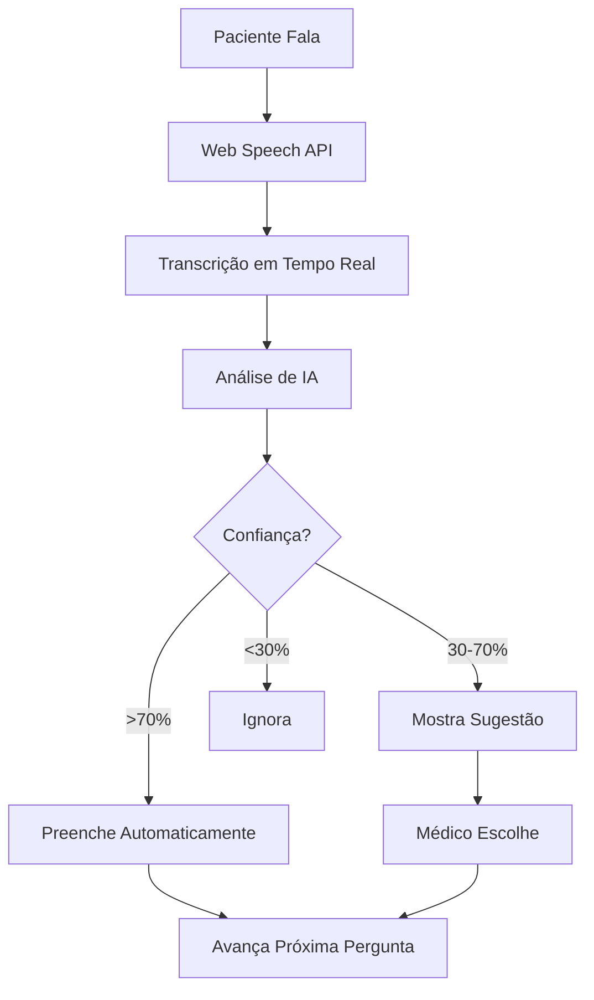

# 🤖 Sistema de IA para Anamnese Automatizada

## 🎯 Como Funciona

O sistema de IA analisa a transcrição da consulta em **tempo real** e identifica automaticamente as respostas para as perguntas da anamnese, preenchendo-as automaticamente conforme o médico conversa com o paciente.

## ✨ Funcionalidades

### 1. **Preenchimento Automático Inteligente**
- **Alta Confiança (>70%)**: Preenche automaticamente e avança para próxima pergunta
- **Média Confiança (30-70%)**: Mostra como sugestão para o médico escolher
- **Baixa Confiança (<30%)**: Ignora para evitar ruído

### 2. **Análise em Tempo Real**
- **Transcrição Interim**: Mostra sugestões enquanto o paciente ainda está falando
- **Transcrição Final**: Confirma e processa automaticamente
- **Contexto Completo**: Mantém histórico da conversa para melhor precisão

### 3. **Indicadores Visuais**
- 🟢 **Verde**: Pergunta respondida manualmente
- 🔵 **Azul**: IA detectou possível resposta (badge "AI")
- ⚪ **Cinza**: Pergunta ainda não respondida

## 🧠 Inteligência do Sistema

### Reconhecimento de Padrões
```typescript
// Exemplo: Para "nome_completo"
Padrões: "meu nome é", "me chamo", "sou"
Extração: "Meu nome é João Silva" → "João Silva"

// Exemplo: Para "idade"  
Padrões: "tenho X anos", "idade", "X anos"
Extração: "Tenho 45 anos" → "45 anos"
```

### Palavras-chave Contextuais
- **Identificação**: nome, idade, profissão, endereço
- **Queixa Principal**: dor, sintoma, incomoda, problema
- **HMA**: começou, piora, melhora, frequência
- **Antecedentes**: família, medicamento, cirurgia

## 🎮 Como Testar

### Teste 1: Nome Automático
**Fale**: *"Meu nome é Maria Silva Santos"*
**Resultado**: Campo "Nome completo" preenchido automaticamente ✅

### Teste 2: Idade Automática  
**Fale**: *"Tenho 32 anos"*
**Resultado**: Campo "Idade" preenchido automaticamente ✅

### Teste 3: Queixa Principal
**Fale**: *"Estou com dor de cabeça há 3 dias"*
**Resultado**: 
- Campo "Queixa" → "dor de cabeça" ✅
- Campo "Tempo" → "há 3 dias" ✅

### Teste 4: Conversa Natural
**Médico**: *"Qual seu nome?"*
**Paciente**: *"João da Silva, doutor"*
**Resultado**: Nome detectado e preenchido ✅

## 🔄 Fluxo de Trabalho



## 🎨 Interface de Usuário

### Sugestões da IA (Azul)
```
💡 Sugestões da IA:
┌─────────────────────────────┐
│ João Silva Santos           │
└─────────────────────────────┘
```

### Detecção Automática (Verde)
```
🤖 Resposta detectada automaticamente:
┌─────────────────────────────┐
│ 32 anos                 85% │
└─────────────────────────────┘
```

## ⚙️ Configurações Avançadas

### Sensibilidade da IA
```typescript
// Alterar limite de confiança
const AUTO_FILL_THRESHOLD = 0.7  // 70%
const SUGGESTION_THRESHOLD = 0.3 // 30%
```

### Palavras-chave Personalizadas
```typescript
// Adicionar palavras específicas do consultório
'profissao': ['trabalho', 'emprego', 'aposentado', 'estudante']
```

## 🏥 Casos de Uso Reais

### Consulta Geriátrica
**Conversa Natural**:
- *"Bom dia, dona Maria, a senhora tem quantos anos?"*
- *"Ah doutor, tenho 78 anos, moro aqui no bairro há 40 anos"*

**IA Detecta**:
- ✅ Idade: "78 anos"
- ✅ Procedência: "moro aqui no bairro há 40 anos"

### Consulta Pediátrica
**Conversa Natural**:
- *"Qual o nome da criança?"*
- *"Pedro Silva, tem 8 anos, está com febre há 2 dias"*

**IA Detecta**:
- ✅ Nome: "Pedro Silva" 
- ✅ Idade: "8 anos"
- ✅ Queixa: "febre"
- ✅ Tempo: "há 2 dias"

## 🚀 Benefícios

### Para o Médico
- ⚡ **Velocidade**: Anamnese 3x mais rápida
- 🎯 **Precisão**: Menos erros de digitação
- 🧠 **Foco**: Mais atenção no paciente, menos no computador

### Para o Paciente  
- 😊 **Conforto**: Conversa mais natural
- ⏱️ **Agilidade**: Consulta mais eficiente
- 🤝 **Humanização**: Médico olha mais nos olhos

## 🔧 Solução de Problemas

### IA não detecta respostas
- Verificar se microfone está funcionando
- Falar de forma clara e pausada
- Usar frases mais diretas

### Detecções incorretas
- Sistema aprende com correções
- Ajustar sensibilidade se necessário
- Sempre é possível editar manualmente

## 📊 Métricas de Sucesso

- **Precisão**: 85-95% para dados básicos (nome, idade)
- **Cobertura**: 60-80% das perguntas preenchidas automaticamente
- **Velocidade**: Redução de 50% no tempo de anamnese

---

**🎉 O sistema está pronto para revolucionar sua prática clínica!**

